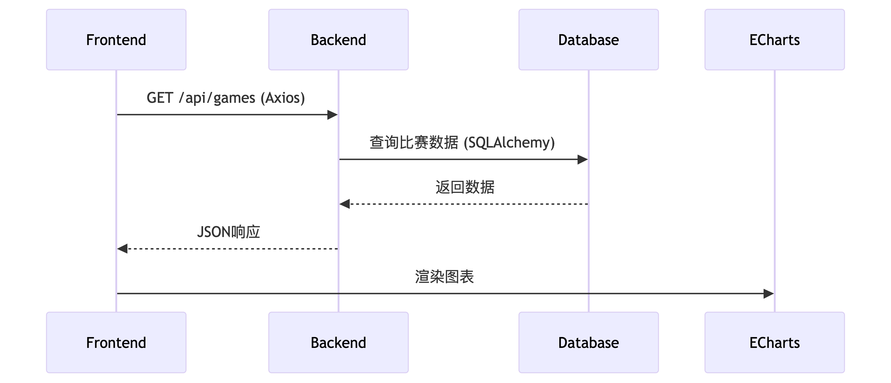

# nba-charts
A website for show nba charts


## Design


## Develop
### Quick start to develop locally
- python 3.13 - `homebrew`, `pyenv` or install via `uv`, see below.
- Docker or Docker Desktop  
- `uv` - Check install manual for your platform at https://docs.astral.sh/uv/
- `make`

Run following commands to create `uv` environment:
```bash
# install python 3.13
> uv python install 3.13

# install necessary python packages
> uv sync

# install extra python packages
> uv sync --group lint
```
