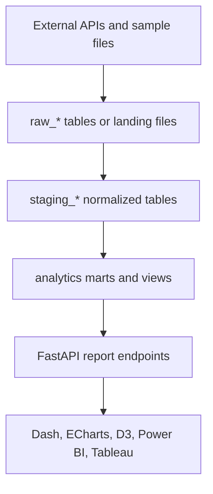
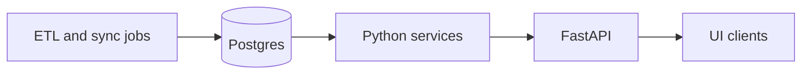

# Backend data architecture

## Recommendation

Use Postgres as the local source of truth once the project starts ingesting multiple APIs. Keep sample files for tests and proofs of concept, but let the backend read primarily from curated database tables and views.

## Data layers

## Suggested table families

- `etl_runs` for run history, source, status, and timestamps
- `raw_api_payloads` for auditability when an upstream response changes
- `dim_players` and `dim_teams` for stable entity dimensions
- `fact_shots` for shot-level data such as Kobe sample rows and future API ingests
- `fact_player_season` for season-level rollups used by report endpoints
- report views or materialized views for UI-specific query shapes

## Query ownership

- ETL owns ingestion, deduping, and incremental refresh
- Postgres owns storage, indexing, joins, and reusable aggregates
- service code owns request validation and response shaping
- UI code owns filters, playback, and presentation only

## Initial rollout path

1. keep existing file-backed demos working
2. continue using Postgres for reference-data sync jobs
3. add shot-level tables for sample and future API-driven shot data
4. move reusable report endpoints to read from curated database views
5. keep live API calls only for exploratory or fallback endpoints

## Local development stance

- run Postgres locally on `localhost:5432`
- keep credentials in `.env` only and do not commit them
- prefer `NBA_CHARTS_DB_DSN` when a single DSN is easiest
- otherwise use `NBA_CHARTS_DB_HOST`, `NBA_CHARTS_DB_PORT`, `NBA_CHARTS_DB_NAME`, `NBA_CHARTS_DB_USER`, and `NBA_CHARTS_DB_PASSWORD`
