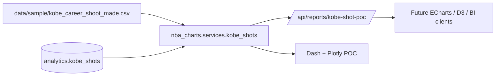

# Kobe shot POC

## Current status

- implemented first tool option: Dash + Plotly
- command: `make run-kobe-shot-poc`
- direct command: `uv run nba-charts-kobe-shot-poc`
- local API data endpoint for future tool options: `/api/reports/kobe-shot-poc`
- backend mode: file, postgres, or auto via `NBA_CHARTS_KOBE_DATA_SOURCE`
- browser ECharts route: `/echarts/kobe-shot-poc` from the FastAPI server

## What the first POC does

- loads from `analytics.kobe_shots` when Postgres is prepared, otherwise falls back to `data/sample/kobe_career_shoot_made.csv` in auto mode
- defaults to a made-shot view so the prototype stays focused on Kobe's scoring footprint
- lets you scrub season by season or switch to a cumulative career view
- adds filters for `shot_made_flag` (`1` made, `0` missed), court zone, and playoff-only slices
- pairs the shot map with zone totals and a season-level trend panel

## Why Dash + Plotly goes first

- it fits the existing Python stack with no new frontend build system
- it is the fastest way to pressure-test the sample data and interaction model
- the same data service can later feed ECharts or D3 without reshaping the dataset again

## POC plan by tool option

### Dash + Plotly

- implemented now as the first local proof of concept
- best for validating filters, playback, and API payload shape

### ECharts

- now implemented as a browser-first shot map served by FastAPI
- reuses `/api/reports/kobe-shot-poc` and renders the view in a custom HTML + JavaScript frontend
- strongest fit if the team wants richer transitions, denser point rendering, and easier future UI customization

### D3.js

- best if the Kobe sample becomes a story-driven visual essay
- good fit for annotated sequences, evolving callouts, and custom court geometry
- highest implementation cost, so it makes more sense after the Dash interactions settle

### Power BI and Tableau

- useful for stakeholder sharing and light filtering once the shot dataset is stable
- weakest fit for the custom half-court experience, but good for distribution and KPI views
- easiest path is to export the API payload or load the CSV directly into a BI model
