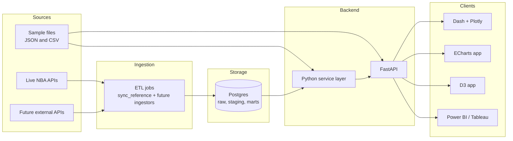
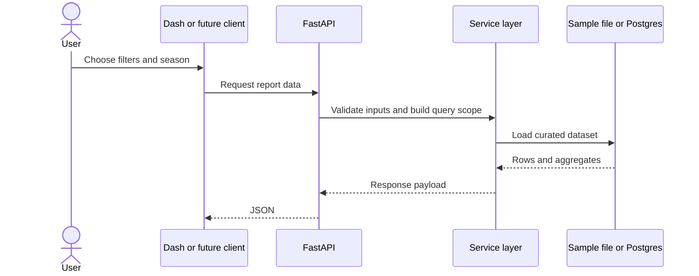

# System architecture

## Intent

- keep local sample-data POCs fast to build
- add a stable backend shape that can grow into a Postgres-backed analytics service
- let one API layer support Dash, future custom frontends, and BI tools

## Current and target shape

## Runtime request flow

## What is true today

- the `fg3m` report and Kobe shot POC are sample-data backed
- reference-data sync commands already target PostgreSQL for players and teams
- the shot-chart endpoints still call live NBA APIs directly

## Target operating model

- ETL jobs ingest from external APIs into Postgres
- FastAPI reads curated tables or views instead of hitting external APIs on demand
- UI clients stay thin and focus on interaction, not data shaping
- sample files remain useful for tests, demos, and offline prototyping

## Why this matters before adding more APIs

- API rate limits and response changes are easier to absorb in ETL than in request-time code
- snapshots make historical analytics reproducible
- one database model is easier to join and index than many raw files or live API responses
- the same backend can feed Dash now and ECharts, D3, or BI later
